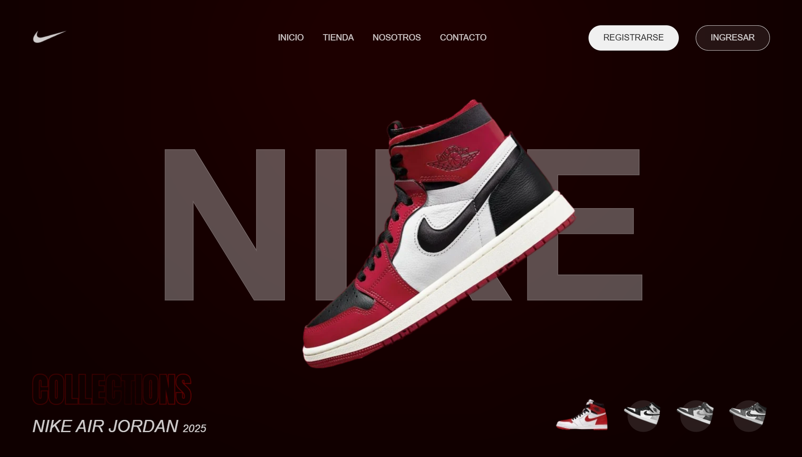

<div align="center">

# 👟 Slider de Zapatillas Nike

[](https://choosealicense.com/licenses/mit/)
[](https://developer.mozilla.org/en-US/docs/Web/HTML)
[](https://developer.mozilla.org/en-US/docs/Web/CSS)
[](https://developer.mozilla.org/en-US/docs/Web/JavaScript)

<p align="center">
  
</p>

[Demo en Vivo](https://gianmattus-programmer.github.io/slider-nike/) | [Reportar Bug](https://github.com/gianmattus-programmer/slider-nike/issues) | [Solicitar Característica](https://github.com/gianmattus-programmer/slider-nike/issues)

</div>

## 📋 Tabla de Contenidos
- [Sobre el Proyecto](#-sobre-el-proyecto)
- [Características](#-características)
- [Demo](#-demo)
- [Tecnologías](#%EF%B8%8F-tecnologías)
- [Instalación](#-instalación)
- [Uso](#-uso)
- [Roadmap](#-roadmap)
- [Contribución](#-contribución)
- [Contacto](#-contacto)

## 🎯 Sobre el Proyecto

<p align="center">
  
</p>

Un slider interactivo y moderno que presenta la colección Nike Air Jordan 2025. Este proyecto demuestra la implementación de animaciones fluidas y un diseño responsivo utilizando tecnologías web modernas.

## ✨ Características

### Interfaz de Usuario
- 🎨 Diseño minimalista y moderno
- 📱 Totalmente responsivo
- 🖼️ Transiciones suaves
- 🎯 Navegación intuitiva

### Técnicas
- ⚡ Optimización de rendimiento
- 🔄 Lazy loading de imágenes
- 📦 Sin dependencias externas
- 🌐 Cross-browser compatible

## 🎮 Demo

<details>
<summary>📸 Capturas de Pantalla</summary>
<br>

| Desktop | Mobile |
|---------|---------|
|  |  |

</details>

## 🛠️ Tecnologías

<p align="center">
  
</p>

- HTML5 - Estructura semántica
- CSS3 - Animaciones y diseño responsive
- JavaScript - Interactividad y control del slider
- Git - Control de versiones

## 📦 Instalación

1. Clona este repositorio:
```bash
git clone https://github.com/gianmattus-programmer/slider-nike.git
```

2. Navega al directorio del proyecto:
```bash
cd slider-nike/slider-tenis-nike
```

3. Abre el archivo `index.html` en tu navegador preferido.

## 💻 Uso

### Navegación
```javascript
// Cambiar entre modelos
clickMiniaturas();    // Selecciona un modelo específico
deslizarDerecha();    // Próximo modelo
deslizarIzquierda();  // Modelo anterior
```

### Personalización
```css
/* Ejemplo de personalización de colores */
.slider {
  --primary-color: #ff0000;
  --secondary-color: #000000;
}
```

## 🗺 Roadmap

- [x] Diseño base y funcionalidad del slider
- [x] Animaciones y transiciones
- [ ] Modo oscuro
- [ ] Soporte para gestos táctiles
- [ ] Integración con API de productos
- [ ] Modo presentación automática

## 📁 Estructura del Proyecto

```
slider-tenis-nike/
│   index.html
│   style.css
│   script.js
│
└───img/
    │   nike-logo.webp
    │   vermelho-principal.webp
    │   cinza-principal.webp
    │   verde-principal.webp
    │   marrom-principal.webp
    └── ...
```

## ✨ Contribución

Las contribuciones son bienvenidas:

1. Haz Fork del proyecto
2. Crea una rama para tu característica (`git checkout -b feature/AmazingFeature`)
3. Commit a tus cambios (`git commit -m 'Add: AmazingFeature'`)
4. Push a la rama (`git push origin feature/AmazingFeature`)
5. Abre un Pull Request

## 📞 Contacto

<div align="center">

[](https://tu-portfolio.com)
[](https://linkedin.com/in/tu-perfil)
[](https://twitter.com/tu-perfil)

</div>

## 📊 Estadísticas del Proyecto


## 👤 Autor

**Gianmattus-Programmer**

- GitHub: [@gianmattus-programmer](https://github.com/gianmattus-programmer)

## 📝 Licencia

Este proyecto está bajo la Licencia MIT - ver el archivo [LICENSE.md](LICENSE.md) para más detalles.
